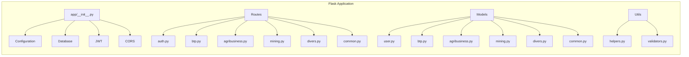
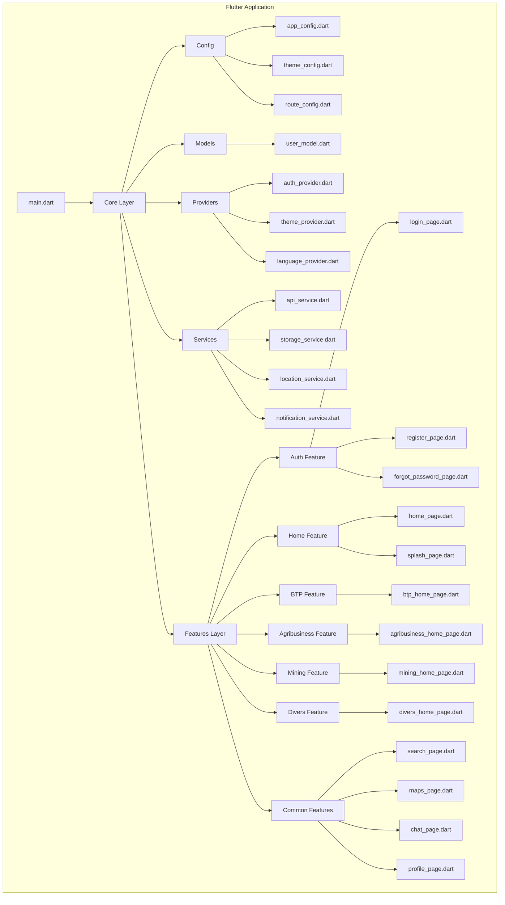
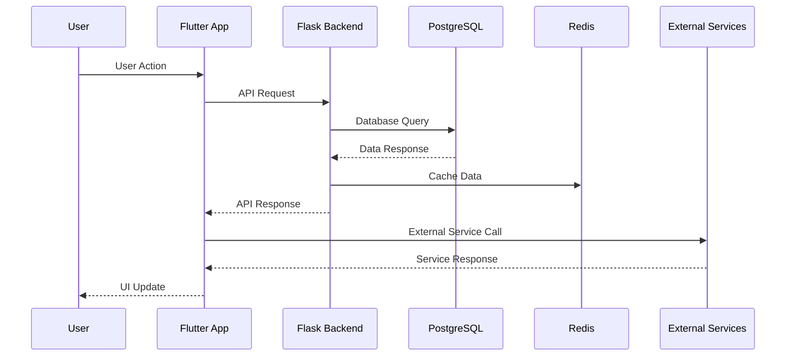
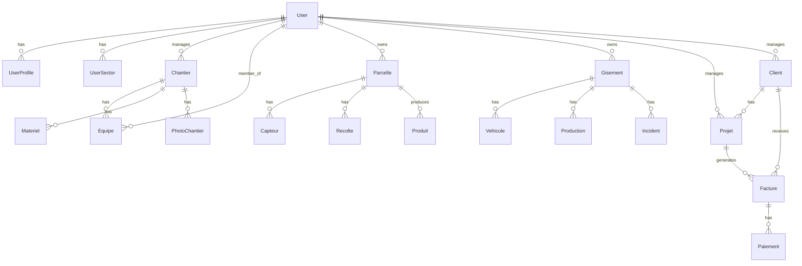

# Architecture du Projet BTP Multi-Sector

## Vue d'ensemble de l'architecture

```mermaid
graph TB
    subgraph "Frontend (Flutter)"
        A[App Flutter] --> B[Core Layer]
        B --> C[Features Layer]
        C --> D[Presentation Layer]
        
        B --> B1[Config]
        B --> B2[Models]
        B --> B3[Providers]
        B --> B4[Services]
        
        C --> C1[Auth]
        C --> C2[Home]
        C --> C3[BTP]
        C --> C4[Agribusiness]
        C --> C5[Mining]
        C --> C6[Divers]
        C --> C7[Common]
        
        D --> D1[Pages]
        D --> D2[Widgets]
    end
    
    subgraph "Backend (Flask)"
        E[Flask App] --> F[Routes]
        E --> G[Models]
        E --> H[Utils]
        
        F --> F1[Auth Routes]
        F --> F2[BTP Routes]
        F --> F3[Agribusiness Routes]
        F --> F4[Mining Routes]
        F --> F5[Divers Routes]
        F --> F6[Common Routes]
        
        G --> G1[User Models]
        G --> G2[BTP Models]
        G --> G3[Agribusiness Models]
        G --> G4[Mining Models]
        G --> G5[Divers Models]
        G --> G6[Common Models]
    end
    
    subgraph "Base de Données"
        I[(PostgreSQL)]
        I --> I1[PostGIS Extension]
        I --> I2[Users Tables]
        I --> I3[BTP Tables]
        I --> I4[Agribusiness Tables]
        I --> I5[Mining Tables]
        I --> I6[Divers Tables]
    end
    
    subgraph "Services Externes"
        J[Redis Cache]
        K[Firebase]
        L[Google Maps]
        M[Stripe Payments]
    end
    
    A --> E
    E --> I
    E --> J
    A --> K
    A --> L
    A --> M
```

## Architecture détaillée du Backend

## Architecture détaillée du Frontend

## Flux de données

## Modèles de données principaux

## Technologies utilisées

### Backend
- **Flask** : Framework web Python
- **PostgreSQL** : Base de données relationnelle
- **PostGIS** : Extension géospatiale
- **Redis** : Cache et sessions
- **Celery** : Tâches asynchrones
- **JWT** : Authentification
- **SQLAlchemy** : ORM

### Frontend
- **Flutter** : Framework mobile
- **Dart** : Langage de programmation
- **Riverpod** : Gestion d'état
- **GoRouter** : Navigation
- **Hive** : Stockage local
- **Firebase** : Notifications push
- **Google Maps** : Cartographie

### Services externes
- **Firebase** : Notifications push
- **Google Maps** : Cartographie
- **Stripe** : Paiements
- **Redis** : Cache

